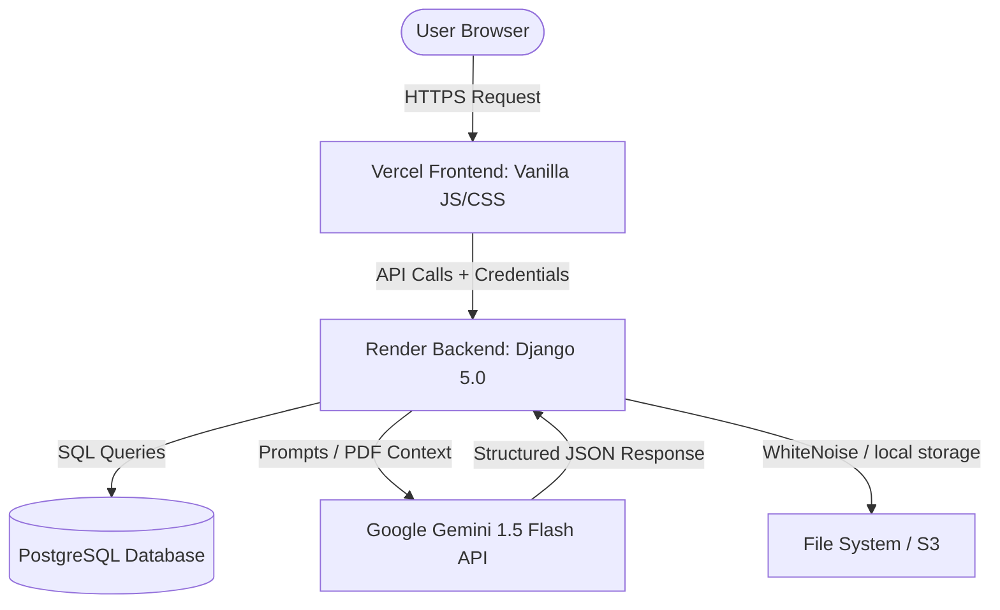

# 🧠 Quezal: Complete Enterprise System & Architecture Documentation

Welcome to the definitive system documentation for **Quezal**, an enterprise-grade, AI-powered quiz generation and active-learning platform. This document covers the comprehensive details of the Quezal application, including its core value proposition, technical stack, architecture, feature catalog, user journeys, database schemas, APIs, and deployment guides.

---

## 📖 Table of Contents
1. [Overview & Product Value Proposition](#1-overview--product-value-proposition)
2. [Visual Design & User Experience Philosophy](#2-visual-design--user-experience-philosophy)
3. [System Architecture & Core Flows](#3-system-architecture--core-flows)
4. [In-Depth Feature Catalog](#4-in-depth-feature-catalog)
5. [Complete API Reference Manual](#5-complete-api-reference-manual)
6. [Database Schema & Data Models](#6-database-schema--data-models)
7. [Installation, Setup, & Orchestration Guide](#7-installation-setup--orchestration-guide)
8. [Production Deployment Playbook](#8-production-deployment-playbook)
9. [Operational Diagnostics & System Verification](#9-operational-diagnostics--system-verification)

---

## 1. Overview & Product Value Proposition

**Quezal** bridges the gap between static instructional text and active learner recall by automating the generation of high-quality assessment questions from text-heavy documents. 

Traditional assessment generation is a bottleneck for modern educators; creating rigorous, pedagogically sound questions that challenge critical thinking rather than simple memorization is time-consuming. Quezal resolves this by utilizing **Google Gemini 1.5 Flash** models to parse raw text streams and generate interactive, context-aware evaluations in seconds.

### Target Audiences & Roles
The system accommodates two distinct user archetypes, each with customized workflows:
*   **The Educator (Teacher)**: Uploads core source material (PDFs up to 16MB), configures parameters (difficulty, format, and volume), generates tests, archives them in their personal library, prints or distributes them, and manages student materials.
*   **The Learner (Student)**: Navigates ready-made learning assessments, engages in an interactive testing interface, receives real-time scoring, and accesses AI-generated feedback and conceptual explanations immediately upon responding.

---

## 2. Visual Design & User Experience Philosophy

Quezal follows the **"Vanguard Modern"** design language, a glassmorphic aesthetic built with Vanilla HTML5, advanced CSS variables, and zero heavy frameworks, ensuring loading speeds and 60fps micro-interactions.

### Styling & CSS Architecture
*   **HSL Palette Control**: Color systems are governed entirely by custom HSL (Hue, Saturation, Lightness) properties, allowing for seamless dark-to-light theme-toggling by adjusting the lightness variables:
    *   `Primary`: Purple `HSL(262, 83%, 58%)`
    *   `Accent`: Cyan `HSL(189, 94%, 43%)`
    *   `Background (Light)`: A rich gradient blending `#667eea` and `#764ba2`.
    *   `Background (Dark)`: A deep space theme blending `#1e293b` and `#334155`.
*   **Glassmorphism**: Component layouts feature translucent panels (`rgba(255, 255, 255, 0.1)`) bound by micro-borders and softened with `backdrop-filter: blur(12px)`.
*   **Tactile Animation System**: 
    *   **Smooth Scaling**: Element hover states use subtle transitions (`transform: translateY(-2px) scale(1.01)`).
    *   **Floating Particle Systems**: Lightweight background animation tags float at varying rates to maintain visual engagement.
    *   **Interactive Visual States**: Buttons and inputs fade into active colors instantly on user interaction.

---

## 3. System Architecture & Core Flows

Quezal operates as a **Decoupled Single Page Application (SPA)**, dividing user interaction from the resource-intensive intelligence engine.



### Decoupled Topology
1.  **Interaction Layer (Frontend)**: Serves static HSL-based sheets and DOM-manipulating Vanilla JS from Vercel's Edge network, communicating with the backend via `fetch` operations with `{ credentials: 'include' }`.
2.  **Intelligence Layer (Backend)**: A Django 5.0 framework running a Django REST API on Render. It processes PDF files, validates payloads, manages sessions, and interfaces with the Google Generative AI SDK.
3.  **Persistence Layer (Database)**: Driven by SQLite locally and Neon.tech distributed PostgreSQL in production for quick read-write speeds on sessions, profiles, and quiz metadata records.

### The AI Generation Pipeline
The core process for converting static documents into smart questions is structured as follows:

```
[User Selects PDF] 
       │
       ▼
[Multipart Form POST to /upload] 
       │
       ▼
[Django PyPDF2 Binary Text Extraction]
       │
       ▼
[Dynamic Prompt Engineering with Pedagogy Rules]
       │
       ▼
[Google Gemini v1beta Models Processing]
       │
       ▼
[JSON Clean-up, Schema Validation, & Storage]
       │
       ▼
[Success Response to UI & PDF Exporter Ready]
```

### Security & Cross-Domain Sessions
To prevent access-token compromises, Quezal uses a **token-less, session-based cookie configuration**:
*   Both Vercel and Render coordinate using CORS headers allowing credential passing (`CORS_ALLOW_CREDENTIALS = True`).
*   Session and CSRF cookies use `SameSite='None'` and `Secure=True` settings, enabling secure tracking across different domains.
*   Cross-Site Scripting (XSS) is mitigated by avoiding local storage for user credentials.

---

## 4. In-Depth Feature Catalog

### 4.1. Account & Security Center
*   **Role-Based Selection**: During sign-up, users select between **Student** and **Teacher** roles. This determines access permissions for quiz generation features.
*   **Argon2/SHA-256 Hashing**: Passwords are securely hashed before storing, preventing clear-text leaks even in the event of a database compromise.
*   **Profile Manager**: Users can edit their profile metadata (such as full names) and update passwords securely, requiring current credentials for confirmation.

### 4.2. Smart PDF Ingestion & Text Extraction
*   **Drag-and-Drop Uploader**: An interactive drop zone supporting files up to 16MB. It features client-side size validation and type constraints.
*   **Binary Stream Ingestion**: The Django backend uses `PyPDF2` to read file streams directly from memory, extracting text without writing temporary files to disk.
*   **Size and Quota Guards**: Limits text payload lengths (up to 15,000 characters) to optimize token usage and avoid API limit issues.

### 4.3. The AI Generation Command Center
The quiz generation process offers several customization options:
*   **Volume Scales**: Users can request quizzes with **4, 6, 8, 10, 12, 15, or 20 questions**.
*   **Proficiency Leveling**: Quizzes can be generated at **Easy**, **Medium**, or **Hard** difficulties, adjusting the depth of vocabulary and reasoning required.
*   **Assessment Formats**:
    *   `MCQ Assault Mode`: Generates multiple-choice questions with exactly 4 options and detailed explanations for the correct answers.
    *   `Binary Strike Mode`: Generates True/False questions that test clear, conceptual assertions.
    *   `Stealth Mission Mode`: Generates Fill-in-the-Blank questions using standardized text slots (`_______`).
    *   `Intelligence Report Mode`: Generates complex essay questions that prompt students for critical analysis and outline grading guidelines.
    *   `Strategic Mix`: Automatically combines multiple formats into a single comprehensive quiz.

### 4.4. The Interactive Quiz Interface
*   **Client-Side Evaluation**: Immediate assessment of student answers without additional database calls.
*   **Visual Correction Indicators**: Selected choices instantly transition to HSL green (correct) or HSL red (incorrect).
*   **Explanation Triggering**: Explanations can be revealed with a single click, providing immediate pedagogical feedback.

### 4.5. Personal Quiz Library
*   **Creation Archive**: Saved quizzes are displayed in a clean grid format, showing metadata such as question counts, difficulties, formats, and creation dates.
*   **System Diagnostics**: The dashboard tracks total quizzes created, questions answered, monthly generation activity, and completion metrics.
*   **Activity Timelines**: Tracks recent history to show a timeline of the user's latest quiz deployments.

### 4.6. Documents, Exporters, & Sharing
*   **ReportLab PDF Exporter**: A built-in PDF engine dynamically maps JSON structures into clean, printable PDF documents.
*   **Native Web Share**: Uses the Web Share API to share links easily, falling back to clipboard copy if the browser doesn't support native sharing.

---

## 5. Complete API Reference Manual

The following table provides an overview of the platform's API endpoints:

| Route Path | Allowed HTTP | Session Type | Objective / Behavioral Role |
| :--- | :--- | :--- | :--- |
| `/` | `GET` | Public | Serves the main SPA landing page (`index.html`) |
| `/user` | `GET` | User Session | Serves the customized dashboard (`user.html`) |
| `/api/signup` | `POST` | Public | Registers new users as Teachers or Students |
| `/api/login` | `POST` | Public | Authenticates credentials and starts the session |
| `/api/logout` | `POST` | User Session | Ends the session and clears cookies |
| `/api/me` | `GET` | Public | Validates session status and returns user profiles |
| `/upload` | `POST` | Teacher | Processes PDFs and generates quizzes |
| `/download/<filename>`| `GET` | User Session | Downloads quiz files in JSON or PDF formats |
| `/api/my-quizzes` | `GET` | User Session | Fetches quiz history for the authenticated user |
| `/api/my-quizzes/<id>`| `DELETE` | Creator | Deletes a specified quiz and database record |
| `/api/profile` | `GET`, `PUT` | User Session | Displays or updates profile names |
| `/api/change-password`| `POST` | User Session | Verifies and updates user passwords |
| `/api/battle-stats` | `GET` | Public | Collects metrics on modes, quizzes, and difficulty |
| `/api/take-quiz/<id>` | `GET` | Student | Fetches quiz datasets for interactive testing |
| `/api/battle-health` | `GET` | Public | Runs system checks on files, APIs, and formats |

---

### Detailed Payload & Response Specifications

#### 1. User Sign Up (`POST /api/signup`)
*   **Headers**: `Content-Type: application/json`
*   **Request Payload**:
    ```json
    {
      "email": "educator@academy.edu",
      "password": "SecurePassword123",
      "name": "Dr. Sarah Jenkins",
      "user_type": "teacher"
    }
    ```
*   **Success Response (`200 OK`)**:
    ```json
    {
      "success": true,
      "user": {
        "id": 14,
        "email": "educator@academy.edu",
        "name": "Dr. Sarah Jenkins",
        "user_type": "teacher"
      }
    }
    ```
*   **Errors**:
    *   `400 Bad Request`: Missing fields or invalid role type.
    *   `409 Conflict`: Email already registered.

---

#### 2. Quiz Generation (`POST /upload`)
*   **Headers**: `Multipart/form-data`
*   **Request Payload**:
    *   `pdf_file`: Binary PDF file stream
    *   `num_questions`: Integer (4 to 20)
    *   `difficulty`: "Easy" | "Medium" | "Hard"
    *   `question_types`: "mcq" | "true_false" | "fill_blank" | "essay" | "mixed"
*   **Success Response (`200 OK`)**:
    ```json
    {
      "success": true,
      "battle_status": "VICTORY_ACHIEVED",
      "quiz_data": {
        "questions": [
          {
            "question": "What is the primary objective in database normalization?",
            "type": "mcq",
            "options": [
              "A) Increase storage space",
              "B) Eliminate data redundancy",
              "C) Slow down queries",
              "D) Increase complexity"
            ],
            "correct_answer": "B",
            "explanation": "Database normalization eliminates redundancy and ensures data integrity"
          }
        ]
      },
      "question_types": { "mcq": 1 },
      "result_file": "iqbattle_result_20260529_153000.json",
      "battle_stats": {
        "total_questions": 1,
        "battle_mode": "mcq",
        "difficulty_protocol": "Medium",
        "deployment_time": "15:30:00"
      },
      "message": "IQBattle deployed: 1 questions ready for intellectual combat!"
    }
    ```
*   **Errors**:
    *   `401 Unauthorized`: No active session.
    *   `400 Bad Request`: No PDF uploaded or invalid file format.
    *   `429 Too Many Requests`: Gemini API rate limit exceeded.

---

#### 3. Diagnostics Health Check (`GET /api/battle-health`)
*   **Success Response (`200 OK`)**:
    ```json
    {
      "battle_system": "IQBattle_v2.0_Django",
      "ai_commander": "Google_AI_Gemini_1.5_Flash",
      "system_status": "OPERATIONAL",
      "battle_arsenal_ready": true,
      "battle_archives_ready": true,
      "ai_credentials_loaded": true,
      "max_arsenal_size": "16MB",
      "supported_battle_modes": ["mixed", "mcq", "true_false", "fill_blank", "essay"],
      "last_system_check": "2026-05-29T15:30:00.123456",
      "overall_status": "READY_FOR_BATTLE"
    }
    ```

---

## 6. Database Schema & Data Models

The SQLite/PostgreSQL architecture consists of two primary models:

```
  ┌───────────────┐                  ┌────────────────┐
  │     users     │                  │    quizzes     │
  ├───────────────┤                  ├────────────────┤
  │ PK id         │◄─────────────────┤ FK user_id     │
  │ email (UQ)    │                  │ PK id          │
  │ name          │                  │ result_filename│
  │ password_hash │                  │ orig_filename  │
  │ user_type     │                  │ num_questions  │
  │ created_at    │                  │ difficulty     │
  └───────────────┘                  │ mode           │
                                     │ created_at     │
                                     └────────────────┘
```

### 1. `users` Table
This table stores user profile and authentication data.

| Column | Data Type | Modifiers / Constraints | Description |
| :--- | :--- | :--- | :--- |
| `id` | `BigAutoField` | `PRIMARY KEY, AUTO_INCREMENT` | Unique identifier |
| `email` | `VARCHAR(254)`| `UNIQUE, NOT NULL` | Verified login email address |
| `name` | `VARCHAR(255)`| `NULLABLE` | User's full name |
| `password_hash`| `VARCHAR(255)`| `NOT NULL` | Hashed password credentials |
| `user_type` | `VARCHAR(50)` | `DEFAULT 'student'` | Roles: `'teacher'` or `'student'` |
| `created_at` | `TIMESTAMP`   | `AUTO_NOW_ADD` | Timestamp of account creation |

---

### 2. `quizzes` Table
This table records quiz metadata and source file locations.

| Column | Data Type | Modifiers / Constraints | Description |
| :--- | :--- | :--- | :--- |
| `id` | `BigAutoField` | `PRIMARY KEY, AUTO_INCREMENT` | Unique identifier |
| `user_id` | `BigInteger`  | `FOREIGN KEY (users.id), CASCADE`| Links to the quiz creator |
| `result_filename`| `VARCHAR(255)`| `NOT NULL` | Path to the saved JSON quiz data |
| `original_filename`| `VARCHAR(255)`| `NULLABLE` | Original uploaded PDF filename |
| `num_questions`| `INTEGER`     | `NOT NULL` | Total number of questions generated |
| `difficulty` | `VARCHAR(50)` | `NOT NULL` | Difficulty: `'Easy'`, `'Medium'`, or `'Hard'` |
| `mode` | `VARCHAR(50)` | `NOT NULL` | Format: `'mcq'`, `'true_false'`, etc. |
| `created_at` | `TIMESTAMP`   | `AUTO_NOW_ADD` | Timestamp of quiz generation |

---

## 7. Installation, Setup, & Orchestration Guide

Follow these steps to configure a local development environment:

### Prerequisites
*   Python 3.12+
*   SQLite3 (installed by default with Python)

### Step-by-Step Setup
1.  **Clone the Repository**:
    ```bash
    git clone <repository_url>
    cd Quezal
    ```

2.  **Create a Virtual Environment**:
    ```bash
    python -m venv venv
    source venv/bin/activate  # On Windows, use: venv\Scripts\activate
    ```

3.  **Install Dependencies**:
    ```bash
    pip install --upgrade pip
    pip install -r requirements.txt
    ```

4.  **Configure Environment Variables**:
    Create a `.env` file in the project's root directory:
    ```ini
    # Core settings
    DJANGO_SECRET_KEY=your_secure_development_secret_key
    DJANGO_DEBUG=True

    # API configuration
    GOOGLE_API_KEY=your_google_gemini_api_credential_token
    PASSWORD_SALT=your_custom_security_password_salt
    ```

5.  **Run Database Migrations**:
    ```bash
    python manage.py migrate
    ```

6.  **Start the Local Server**:
    ```bash
    python manage.py runserver
    ```
    The application will be available at `http://127.0.0.1:8000/`.

---

## 8. Production Deployment Playbook

Quezal is optimized for decoupled deployment with backend operations on **Render** and frontend hosting on **Vercel**.

### Backend Setup (Render)
*   **Build Script (`build.sh`)**:
    ```bash
    #!/usr/bin/env bash
    set -o errexit
    pip install -r requirements.txt
    python manage.py collectstatic --no-input
    python manage.py migrate
    ```
*   **Runtime Environment**: Python 3.12+
*   **Start Command**: `gunicorn config.wsgi:application`
*   **Required Environment Variables**:
    *   `GOOGLE_API_KEY`: Google Gemini API token
    *   `DJANGO_SECRET_KEY`: A secure production secret key
    *   `DJANGO_DEBUG`: Set to `False` in production

---

### Frontend Setup (Vercel)
The frontend uses `vercel.json` to handle CORS settings and route management:

```json
{
  "rewrites": [
    {
      "source": "/(.*)",
      "destination": "/"
    }
  ]
}
```

*   **API Configuration**: Ensure that the `API_BASE_URL` on the frontend points to the active Render backend URL.

---

## 9. Operational Diagnostics & System Verification

The system includes built-in diagnostic features to monitor operational health:

*   **Endpoint Health**: Access `/api/battle-health` to check file directories, API connectivity, and environment variables.
*   **Performance Metrics**: Access `/api/battle-stats` to view detailed reports on generation volume, popular question types, and system performance.
*   **Manual Verification**: To test the local setup, run the development server, navigate to the diagnostic page, and verify that the system returns a status of `READY_FOR_BATTLE`.

---

**Built by the Quezal Engineering Team**  
*Empowering educators and students with smart, AI-driven learning tools.*
